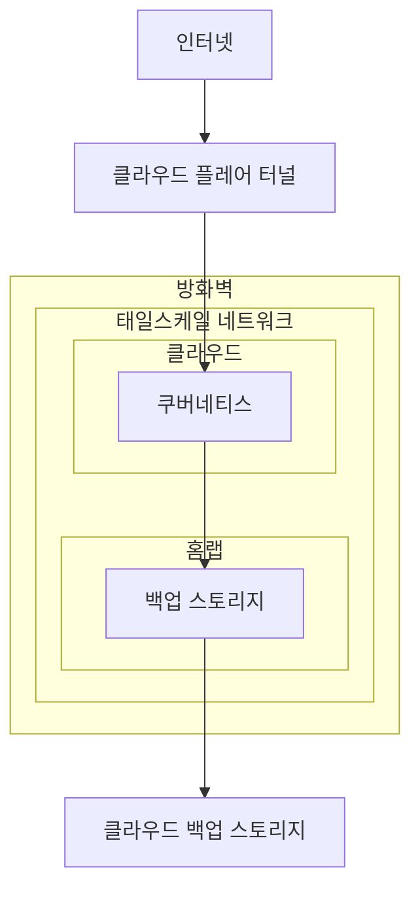

# 타이니랙 인프라



`*.tinyrack.net` 서비스의 쿠버네티스 배포용 GitOps 프로젝트에요. 저장소의 변경사항 발생 시 [Flux](https://fluxcd.io/)를 통해 리모트 서버와 동기화 돼요.

현재 제 인프라는 저비용 운영을 위해 단일 머신에서 동작하고 있어요. 그런데도 쿠버네티스를 쓰는 이유는 Git 으로 인프라를 관리하고 재현성과 재해 복구성을 높이기 위함이에요.

## 보안 전략

이 클러스터는 **제로 트러스트** 보안 전략으로 구축되어 있어요. 그래서 공인 IP를 통한 모든 네트워크 접근은 방화벽에서 차단돼요. 외부에서는 오직 [클라우드플레어 터널](https://blog.cloudflare.com/ko-kr/tag/cloudflare-tunnel/)을 통해서만 서비스로 접근할 수 있고 클러스터 관리는 [테일스케일](https://tailscale.com/)을 통해 가상 사설망에서 이루어져요.

## 데이터 관리

서비스의 모든 영구 데이터(Persistant Data)는 클러스터 내부에 저장돼요. 다시 말해서, 모두가 기피하는 **상태가 있는(Stateful) 쿠버네티스에요.** 데이터는 일정 주기마다 제 홈랩 스토리지 서버에 백업되고, 이는 외부 스토리지 서버로 다시 백업되어 [3-2-1 백업 전략](https://experience.dropbox.com/ko-kr/resources/3-2-1-backup-strategy)을 지키고 있어요.

---

# 인프라 구성

- [Flannel](https://github.com/flannel-io/flannel): 클러스터 네트워크 관리(CNI)
- [CoreDNS](https://coredns.io/): 클러스터 DNS 서버 관리
- [etcd](https://etcd.io/): 클러스터 데이터베이스 관리
- [Cloudflare](https://developers.cloudflare.com/cloudflare-one/connections/connect-networks/): 클라우드플레어 터널 연결, 로드 밸런싱
- [Tailscale](https://tailscale.com/): 가상 사설망에 쿠버네티스 API를 노출
- [Sealed Secrets](https://github.com/bitnami-labs/sealed-secrets): 쿠버네티스 시크릿 관리
- [Local Path Provisioner](https://github.com/rancher/local-path-provisioner): 노드에 독립적인 블록 스토리지 관리
- [Longhorn](https://longhorn.io/): 노드간 공유되는 블록 스토리지 관리
- [CloudNativePG](https://cloudnative-pg.io/): PostgreSQL 데이터베이스 관리
- [MariaDB Operator](https://github.com/mariadb-operator/mariadb-operator/): MariaDB 데이터베이스 관리

# 서비스 구성

- [Ghost](https://ghost.org/): 타이니랙 블로그 (https://tinyrack.net)
- [Discourse](https://www.discourse.org/): 타이니랙 포럼 (https://forum.tinyrack.net)
- [Memos](https://www.usememos.com/): 타이니랙 작업 노트 (https://notes.tinyrack.net)


---

# 하드웨어 요구사항

- open-isci 와 nfsv4 를 지원하는 리눅스 ([Longhorn 요구사항](https://longhorn.io/docs/1.9.0/deploy/install/#installing-open-iscsi))
  - 우분투 24.04 이상이라면 nfs-common 을 설치하면 돼요.

---

# 설치

## Tailscale 설정

```bash
sudo tailscale up \
  --accept-dns=false \
  --reset
```

## K3S 설치

먼저 쿠버네티스를 설치해요. 저는 [K3S](https://k3s.io/)라는 가벼운 배포판을 사용하고 있어요.

```bash
curl -fL https://get.k3s.io | \
sh -s - server \
  --cluster-init \
  --cluster-cidr=10.55.0.0/16 \
  --service-cidr=10.56.0.0/16 \
  --tls-san=100.65.57.48 \
  --tls-san=tinyrack.time-inconnu.ts.net \
  --disable traefik
```

설치에 사용한 옵션과 이유는 다음과 같아요.

- `--cluster-init`: 추후 고가용성 확장을 위해 `SQLite` 대신 `etcd` 를 클러스터 데이터베이스로 사용해요.
- `--cluster-cidr=10.55.0.0/16`: 클러스터의 노드가 할당받는 IP 주소 범위를 변경해요.
- `--service-cidr=10.56.0.0/16`: 클러스터의 서비스가 할당받는 IP 주소 범위를 변경해요.
- `--disable traefik`: 기본 인그레스 컨트롤러를 비활성화해요. 이는 클라우드플레어가 대신해요.
- `--disable servicelb`: 기본 로드 밸런서를 비활성화해요. 이는 클라우드플레어가 대신해요. 내부망 관리로는 `MetalLB`를 대신 사용해요.

## Sealed Secrets 키 등록

인프라를 복원하기 전에, 인프라의 암호화된 시크릿을 클러스터가 복호화할 수 있도록 키 등록이 먼저 필요해요.

```bash
# sealed secrets 이 설치될 네임스페이스 생성
sudo kubectl create namespace sealed-secrets
# 기존 키 복원
sudo kubectl -n sealed-secrets apply -f main.key.yaml --force
```

> 저장소에 등록된 키는 공개키이며, 이 과정에서는 비밀키가 필요해요.

## Flux 에서 앱 복원 해제

다음은 저장소에서 `clusters/production/apps.yaml` 파일의 확장자 뒤에 `.bak` 을 붙여 푸시해요.
이는 서비스를 제외한 인프라만 먼저 복원하고 이후 롱혼에서 서비스의 데이터 볼륨을 복원하기 위해서에요.

## Flux 연동 및 복원

이제 Flux를 연동하고 모든 인프라를 복원해요.

```bash
flux bootstrap gitea \
  --token-auth \
  --hostname=git.winetree94.com \
  --repository=infrastructure \
  --branch=main \
  --path=./clusters/production \
  --owner=tinyrack
```

## 롱혼에서 서비스의 PVC 복원

다음은 서비스들의 PVC 복원을 위해 롱혼의 UI에 접근해요.

```bash
❯ kubectl port-forward service/longhorn-frontend 8000:80 -n longhorn-system
```

이후 시스템 복원에서 마지막 백업 데이터를 복원해요.

## 서비스 복원

이제 저장소에서 `clusters/production/apps.yaml.bak` 파일의 확장자 뒤에 `.bak` 을 제거해 푸시해요.
이제 모든 서비스가 복원되며 기존의 PVC와 연결돼요.

> 데이터베이스는 애플리케이션 레벨에서의 복원을 수행해야 해요.
> Memos, Discourse 는 CloudnativePG 로 알아서 복원되지만 Ghost 는 MySQL 이라 수동으로 복원이 필요해요. 

## ETCD 백업 활성화

마지막으로 ETCD 백업을 활성화해요.

```bash
sudo -s

cat > /etc/rancher/k3s/config.yaml << EOF
etcd-s3: true
etcd-s3-config-secret: k3s-etcd-s3-secret
EOF

systemctl restart k3s
```

---

# 기타

## 암호화

저장소에는 시크릿 생성을 위한 Sealed Secrets 의 공개 키가 포함되어 있어요.

필요한 경우 다음의 명령어를 통해 새로운 시크릿을 생성할 수 있어요.

```bash
kubectl create secret generic docmost-secret \
        --namespace docmost-system \
        --dry-run=client \
        --from-literal=SOME_SECRET_KEY=SOME_SECRET_VALUE \
        --from-literal=SOME_SECRET_KEY=SOME_SECRET_VALUE \
        --from-literal=SOME_SECRET_KEY=SOME_SECRET_VALUE -o yaml \
        | kubeseal --cert ./tinyrack-production-key.crt \
        > ./some.secret.yaml
```
