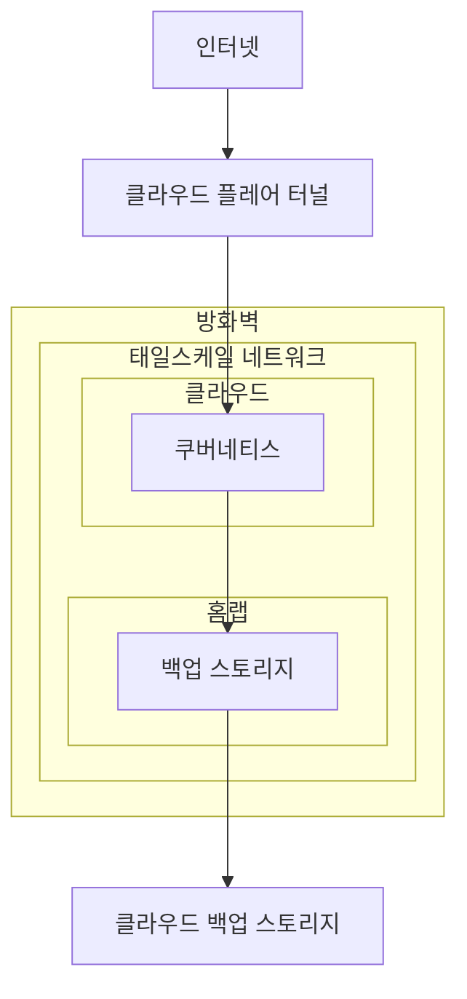

# 타이니랙 인프라


```mermaid
flowchart TB
    internet["인터넷"]
    cloudflare-tunnel["클라우드 플레어 터널"]
    cloud-storage["클라우드 백업 스토리지"]
    internet --> cloudflare-tunnel

    subgraph firewall["방화벽"]
        subgraph tailscale["태일스케일 네트워크"]
            direction LR

            subgraph homelab["홈랩"]
                backup-storage["백업 스토리지"]
            end

            subgraph cloud["클라우드"]
                cluster["쿠버네티스"]
            end

            cluster --> backup-storage
        end
    end

    cloudflare-tunnel --> cluster
    backup-storage --> cloud-storage
```

`*.tinyrack.net` 서비스의 쿠버네티스 배포용 GitOps 프로젝트에요. 저장소의 변경사항 발생 시 [Flux](https://fluxcd.io/)를 통해 리모트 서버와 동기화 돼요.

현재 제 인프라는 저비용 운영을 위해 단일 머신에서 동작하고 있어요. 그런데도 쿠버네티스를 쓰는 이유는 Git 으로 인프라를 관리하고 재현성과 재해 복구성을 높이기 위함이에요.

## 보안 전략

이 클러스터는 **제로 트러스트** 보안 전략으로 구축되어 있어요. 그래서 공인 IP를 통한 모든 네트워크 접근은 방화벽에서 차단돼요. 외부에서는 오직 [클라우드플레어 터널](https://blog.cloudflare.com/ko-kr/tag/cloudflare-tunnel/)을 통해서만 서비스로 접근할 수 있고 클러스터 관리는 [테일스케일](https://tailscale.com/)을 통해 가상 사설망에서 이루어져요.

## 데이터 관리

서비스의 모든 영구 데이터(Persistant Data)는 클러스터 내부에 저장돼요. 다시 말해서, 모두가 기피하는 **상태가 있는(Stateful) 쿠버네티스에요.** 데이터는 일정 주기마다 제 홈랩 스토리지 서버에 백업되고, 이는 외부 스토리지 서버로 다시 백업되어 [3-2-1 백업 전략](https://experience.dropbox.com/ko-kr/resources/3-2-1-backup-strategy)을 지키고 있어요.

---

# 인프라 구성

- [Flannel](https://github.com/flannel-io/flannel): 클러스터 네트워크 관리(CNI)
- [CoreDNS](https://coredns.io/): 클러스터 DNS 서버 관리
- [etcd](https://etcd.io/): 클러스터 데이터베이스 관리
- [Cloudflare](https://developers.cloudflare.com/cloudflare-one/connections/connect-networks/): 클라우드플레어 터널 연결, 로드 밸런싱
- [Tailscale](https://tailscale.com/): 가상 사설망에 쿠버네티스 API를 노출
- [Sealed Secrets](https://github.com/bitnami-labs/sealed-secrets): 쿠버네티스 시크릿 관리
- [Local Path Provisioner](https://github.com/rancher/local-path-provisioner): 노드에 독립적인 블록 스토리지 관리
- [Longhorn](https://longhorn.io/): 노드간 공유되는 블록 스토리지 관리
- [CloudNativePG](https://cloudnative-pg.io/): PostgreSQL 데이터베이스 관리
- [MariaDB Operator](https://github.com/mariadb-operator/mariadb-operator/): MariaDB 데이터베이스 관리

# 서비스 구성

- [Ghost](https://ghost.org/): 타이니랙 블로그 (https://tinyrack.net)
- [Discourse](https://www.discourse.org/): 타이니랙 포럼 (https://forum.tinyrack.net)
- [Memos](https://www.usememos.com/): 타이니랙 작업 노트 (https://notes.tinyrack.net)


---

# 하드웨어 요구사항

- open-isci 와 nfsv4 를 지원하는 리눅스 ([Longhorn 요구사항](https://longhorn.io/docs/1.9.0/deploy/install/#installing-open-iscsi))
  - 우분투 24.04 이상이라면 nfs-common 을 설치하면 돼요.

---

# 재해 복구

교체 머신에는 Ubuntu 24.04 amd64, SSH 사용자, Tailscale 연결을 먼저 준비해요. Ansible은 이 연결을 사용해 K3S 호스트 패키지와 커널 설정, Flannel 기반 단일 서버, Sealed Secrets 복구 키까지 구성해요. 호스트명, Tailscale 로그인, OS 업그레이드는 관리하지 않아요.

Vault 비밀번호와 평문 시크릿은 Git에 커밋하지 않아요. `make vault-edit`에서 `vault_tinyrack_become_password`와 `vault_sealed_secrets_tls_key`를 실제 값으로 바꿔요. Sealed Secrets 키는 `tinyrack-production-key` 하나로 고정하며 controller의 자동 키 갱신은 비활성화해요.

## 앱 복원 일시 중지

다음은 저장소에서 `clusters/production/apps.yaml` 파일의 확장자 뒤에 `.bak` 을 붙여 푸시해요.
이는 서비스를 제외한 인프라만 먼저 복원하고 이후 롱혼에서 서비스의 데이터 볼륨을 복원하기 위해서에요.

## 머신과 K3S 구성

```bash
cd ansible
make vault-edit
make ping
make syntax
make lint
make preflight
make check
make apply
make apply
make verify
cd ..
```

첫 번째 apply는 필요한 호스트 패키지를 설치하고, Longhorn과 충돌하는 multipath를 비활성화하고, iSCSI와 inotify 한계 및 K3S resolver를 구성해요. 이어서 `v1.36.3+k3s1`을 다음 설정으로 설치하거나 기존 설치를 안전하게 관리 상태로 편입해요.

- embedded etcd 단일 서버
- Pod CIDR `10.55.0.0/16`, Service CIDR `10.56.0.0/16`
- TLS SAN `100.65.57.48`, `tinyrack.time-inconnu.ts.net`
- Flannel, kube-proxy, ServiceLB 활성화
- K3S 내장 Traefik 비활성화

기존 클러스터의 CIDR이 다르면 Ansible은 변경하지 않고 중단해요. 두 번째 apply는 `changed=0`이어야 하며, verify는 K3S와 호스트 설정 및 Vault와 일치하는 단일 Sealed Secrets 키를 확인해요. 기존 키가 다르거나 추가 active 키가 있으면 자동으로 덮어쓰거나 삭제하지 않고 중단해요.

## Flux 연동 및 인프라 복원

Ansible 검증이 끝나면 Flux를 연동하고 인프라를 복원해요.

```bash
flux bootstrap github \
  --repository=infrastructure \
  --branch=main \
  --path=./clusters/production \
  --owner=tinyrack-net
```

## Longhorn에서 서비스 PVC 복원

다음은 서비스들의 PVC 복원을 위해 롱혼의 UI에 접근해요.

```bash
❯ kubectl port-forward service/longhorn-frontend 8000:80 -n longhorn-system
```

이후 시스템 복원에서 마지막 백업 데이터를 복원해요.

## 앱 복원 재개

이제 저장소에서 `clusters/production/apps.yaml.bak` 파일의 확장자 뒤에 `.bak` 을 제거해 푸시해요.
이제 모든 서비스가 복원되며 기존의 PVC와 연결돼요.

> 데이터베이스는 애플리케이션 레벨에서 복원해야 해요.
> Memos와 Discourse는 CloudNativePG 백업에서 복원해요.

---

# 기타

## 암호화

저장소에는 시크릿 생성을 위한 Sealed Secrets 의 공개 키가 포함되어 있어요.

필요한 경우 다음의 명령어를 통해 새로운 시크릿을 생성할 수 있어요.

```bash
kubectl create secret generic docmost-secret \
        --namespace docmost-system \
        --dry-run=client \
        --from-literal=SOME_SECRET_KEY=SOME_SECRET_VALUE \
        --from-literal=SOME_SECRET_KEY=SOME_SECRET_VALUE \
        --from-literal=SOME_SECRET_KEY=SOME_SECRET_VALUE -o yaml \
        | kubeseal --cert ./tinyrack-production-key.crt \
        > ./some.secret.yaml
```
